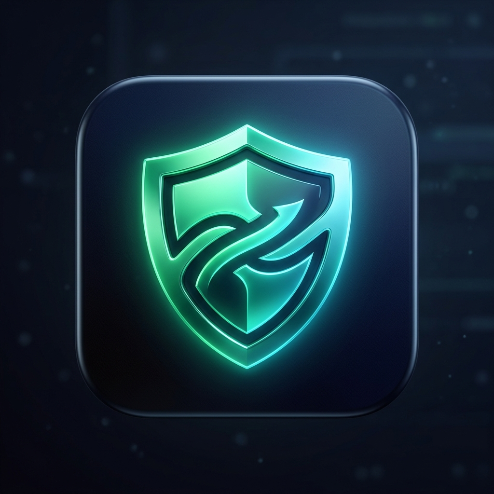

<p align="center">
  
</p>

<h1 align="center">GBPI-Simple</h1>

<p align="center">
  <b>GoodbyeDPI Türkiye — Modern Sistem Tepsisi (Tray) & Kalıcı Servis Yöneticisi</b><br>
  <i>Tek tıkla DPI ve DNS korumasını yönetin, Windows ile sessizce başlatın.</i>
</p>

<p align="center">
  
  
  
  
</p>

---

## 📌 Önemli Bilgilendirme & Referanslar

> [!IMPORTANT]
> **Proje Referansı:**
> Bu proje, **[Çağrı Taşkın (cagritaskn)](https://github.com/cagritaskn)** tarafından geliştirilen **[GoodbyeDPI-Turkey](https://github.com/cagritaskn/GoodbyeDPI-Turkey)** deposundaki Türkiye DNS redirection yapılandırmasını temel alır ve referans kabul eder. Asıl paket filtreleme çekirdeği ValdikSS'in GoodbyeDPI projesine ve WinDivert kütüphanesine dayanmaktadır.

> [!WARNING]
> **Sistem Mimarisi (64-Bit):**
> Bu sürüm ve paket **yalnızca 64-bit (x86_64 / x64)** Windows sistemler için yapılandırılmıştır.

> [!CAUTION]
> **İnternet Servis Sağlayıcısı Uyumluluğu (Turkcell Superonline Harici):**
> Bu konfigürasyon **Turkcell Superonline HARİÇ** tüm servis sağlayıcılar (Türk Telekom, Vodafone, TurkNet, Kablonet, Millenicom, Netspeed vb.) için tasarlanmıştır. Turkcell Superonline kullanıcılarının ağ yapısı ve uyguladığı ek filtrelemeler farklı alternatif parametreler gerektirebilmektedir.

---

## ✨ Neden GBPI-Simple?

Standart GoodbyeDPI Türkiye kurulumunda servisi açmak için `service_install_dnsredir_turkey.cmd`, kapatmak için ise `service_remove.cmd` dosyalarını **her seferinde sağ tıklayıp Yönetici Olarak Çalıştırmak** gerekiyordu. Ayrıca servisin o anda çalışıp çalışmadığını anlamak komut satırı bilgisi gerektiriyordu.

**GBPI-Simple**, tüm bu süreci tek bir şık ve modern masaüstü uygulamasına dönüştürür:

1. **Tek Tıkla Aç / Kapat:**
   - DPI korumasını arayüzden veya sağ alttaki sistem tepsisinden tek tıkla aktif veya pasif yapabilirsiniz.
2. **Yeniden Başlatmalarda Kalıcı Durum:**
   - **Aktif ettiğinizde:** Servis otomatik başlangıç (`start= auto`) ile kurulur. Bilgisayarınızı kapatsanız veya yeniden başlatsanız dahi servis arka planda otomatik olarak çalışmaya devam eder.
   - **Pasif ettiğinizde:** Servis ve WinDivert filtreleri tamamen kaldırılır. Bilgisayarı yeniden başlatsanız da kesinlikle kapalı kalır.
3. **UAC Uyarısı Olmadan Windows Başlangıcı (Görev Zamanlayıcısı):**
   - Windows'un klasik başlangıç kayıtları yönetici izni isteyen programları engeller veya her açılışta kullanıcıya rahatsız edici UAC penceresi çıkarır.
   - GBPI-Simple, Windows Görev Zamanlayıcısı (`Task Scheduler`) ile entegre olarak **en yüksek yetkiyle (`HighestAvailable`) hiçbir parola/onay sormadan sessizce sistem tepsisinde (tray)** başlar.
4. **Gelişmiş Sistem Tepsisi (System Tray) Entegrasyonu:**
   - **Dinamik Kalkan İkonu:** DPI aktifken canlı zümrüt yeşili, kapalıyken koyu arduvaz/kırmızı kalkan simgesi.
   - **Sol Tık:** Ana yönetim panelini açar.
   - **Sağ Tık Menüsü:**
     - Durum göstergesi (`AKTİF` / `PASİF`)
     - Hızlı geçiş (`DPI'ı Aç` / `DPI'ı Kapat`)
     - Servisi Yeniden Başlat
     - Windows ile Başlat (Aç / Kapat)
     - Uygulamadan Çık
5. **Sıfır Arka Plan Yükü (Polling Yok):**
   - Sürekli arka planda işlemciyi yoran sorgu döngüleri (polling) bulunmaz. Uygulama tepside tamamen hareketsiz bekler, %0 CPU ve yok denecek kadar az RAM tüketir.
6. **Modern Koyu Tema (Dark UI):**
   - Windows 11 / modern tasarım standartlarına uygun, okunabilir ve göz yormayan arayüz.

---

## 🚀 Kullanım

1. Bu depoyu indirin veya klonlayın.
2. Klasör içerisindeki `GoodbyeDPI-Manager.exe` dosyasını çalıştırın.
3. Dilerseniz `Masaustune_Kisayol_Olustur.cmd` dosyasına çift tıklayarak masaüstünüze özel ikonlu kısayol ekleyebilirsiniz.
4. Arayüz açıldığında:
   - **DPI Korumasını Başlat (Aktif Et)** butonuna tıklayarak servisi kurup başlatabilirsiniz.
   - **Bilgisayar açıldığında otomatik başlat** kutucuğunu işaretleyerek Windows her açıldığında uygulamanın arka planda tepside hazır olmasını sağlayabilirsiniz.
5. Pencereyi [X] tuşundan kapattığınızda uygulama sistem tepsisinde çalışmaya devam eder.

---

## 🛠️ Kaynak Koddan Derleme

Uygulama, Windows'un içerisinde varsayılan olarak bulunan yerel C# derleyicisi (`csc.exe`) ile derlenmektedir. Harici Visual Studio, Python veya ek SDK kurulumuna ihtiyaç duymaz.

Projeyi kendiniz derlemek için:
```cmd
build.cmd
```
komut dosyasını çalıştırmanız yeterlidir. Doğrudan `app.manifest` ve `app.ico` dosyalarını bağlayarak `GoodbyeDPI-Manager.exe` ikili dosyasını oluşturacaktır.

---

## 📄 Dosya Yapısı

```text
GBPI-Simple/
│
├── assets/
│   └── icon.jpg                           # Proje görsel varlıkları
├── x86_64/                                # 64-bit GoodbyeDPI ikili dosyaları ve WinDivert sürücüsü
│   ├── goodbyedpi.exe
│   ├── WinDivert.dll
│   └── WinDivert64.sys
│
├── GoodbyeDPI-Manager.exe                 # Derlenmiş hazır çalıştırılabilir dosya
├── GoodbyeDPIManager.cs                   # C# WinForms kaynak kodu
├── app.manifest                           # Yönetici yetkisi (requireAdministrator) manifestosu
├── app.ico                                # Çoklu çözünürlüklü ana uygulama ikonu
├── tray_active.ico                        # Aktif durum sistem tepsisi ikonu
├── tray_inactive.ico                      # Pasif durum sistem tepsisi ikonu
├── build.cmd                              # Tek tık derleme betiği
├── Masaustune_Kisayol_Olustur.cmd         # Masaüstü kısayol oluşturucu
└── README.md                              # Dokümantasyon
```

---

## ⚖️ Teşekkür ve Lisans

- **GoodbyeDPI-Turkey:** [Çağrı Taşkın (@cagritaskn)](https://github.com/cagritaskn/GoodbyeDPI-Turkey)
- **GoodbyeDPI Original:** [ValdikSS (@ValdikSS)](https://github.com/ValdikSS/GoodbyeDPI)
- **WinDivert:** [basil00 (@basil00)](https://github.com/basil00/Divert)

Bu proje açık kaynaklı olup Apache 2.0 lisansı altında sunulmaktadır.
